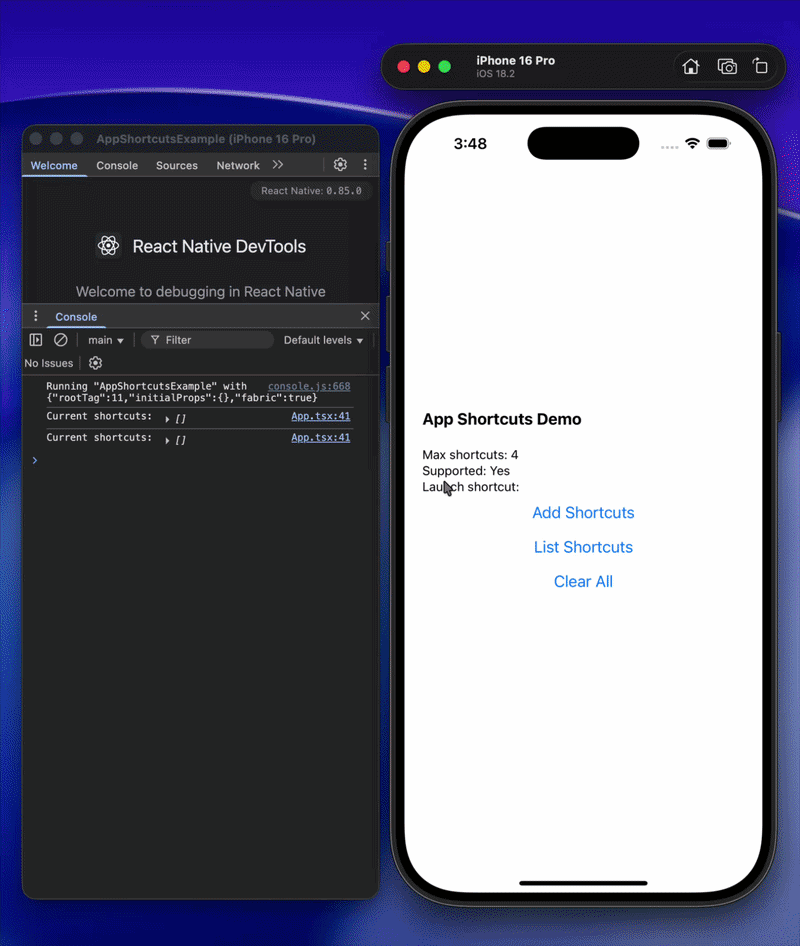
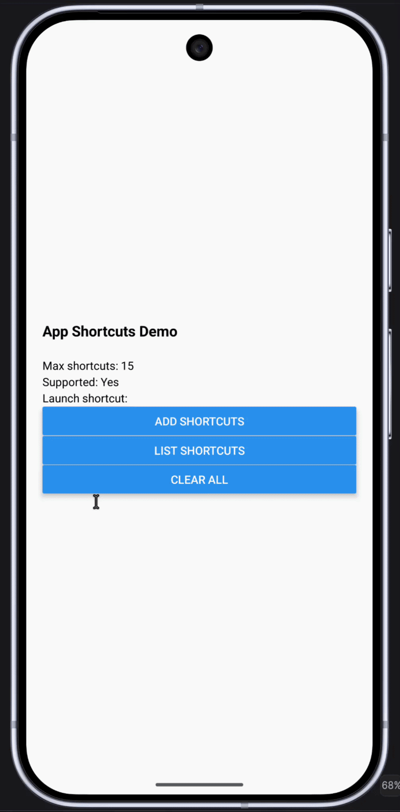

# react-native-turbo-shortcuts

High-performance App Shortcuts and Quick Actions for React Native, built with **TurboModules** and the **New Architecture**.

[npm version](https://www.npmjs.com/package/react-native-turbo-shortcuts)
[License: MIT](https://opensource.org/licenses/MIT)
[Supports New Architecture](https://reactnative.dev/docs/the-new-architecture/landing-page)

---

## Features

- ⚡️ **100% TurboModule**: Direct synchronous and asynchronous JSI bindings without the legacy React Native bridge.
- 📱 **Dynamic Shortcuts**: Add, fetch, and remove shortcuts programmatically at runtime.
- 📌 **Android Pinning**: Full support for launcher pinned shortcuts on modern Android devices.
- 🚀 **Cold & Warm Starts**: Seamlessly detects whether an app was launched or resumed from a shortcut.
- 🎨 **Icons & Subtitles**: Support for native system symbols (SF Symbols on iOS) and drawable resources (Android).
- 🧩 **Type-Safe Payloads**: Send structured data objects directly to your shortcut handlers.

---


## Demo


| iOS Quick Actions (3D Touch / Haptic) | Android App Shortcuts & Pinned Actions |
| ------------------------------------- | -------------------------------------- |
|                                       |                                        |


---


## Installation

```bash
npm install react-native-turbo-shortcuts
# or
yarn add react-native-turbo-shortcuts
```


### iOS Setup

Install CocoaPods dependencies:

```bash
cd ios && pod install
```


#### Handling Shortcuts in `AppDelegate`

To handle shortcut events when the app is backgrounded or cold-launched, wire your `AppDelegate`:

##### Swift (`AppDelegate.swift` — React Native 0.77+)

```swift
import TurboShortcuts

override func application(
  _ application: UIApplication,
  performActionFor shortcutItem: UIApplicationShortcutItem,
  completionHandler: @escaping (Bool) -> Void
) {
  TurboShortcutsLaunchHandler.shared.handleShortcut(shortcutItem)
  completionHandler(true)
}
```


##### Objective-C++ (`AppDelegate.mm`)

```objc
#import <TurboShortcuts/TurboShortcuts.h>

- (void)application:(UIApplication *)application 
performActionForShortcutItem:(UIApplicationShortcutItem *)shortcutItem 
  completionHandler:(void (^)(BOOL succeeded))completionHandler {
  [TurboShortcuts onShortcutReceived:shortcutItem];
  completionHandler(YES);
}
```


### Android Setup

Override `onNewIntent` and `onResume` to pass the updated shortcut intent when the app is already in memory:

##### Kotlin (`MainActivity.kt`)

```kotlin
  override fun onResume() {
    super.onResume()
    intent?.getStringExtra("shortcutId")?.let { id ->
      TurboShortcutsLaunchReceiver.launchShortcutId = id
    }
  }

  override fun onNewIntent(intent: Intent?) {
    super.onNewIntent(intent)
    intent?.getStringExtra("shortcutId")?.let { id ->
      TurboShortcutsLaunchReceiver.launchShortcutId = id
    }
  }
```

---


## Usage

Use AppState to check `TurboShortcuts.getLaunchShortcut()` whenever the app transitions into an active state (handling both cold starts and resumes from the background):

```tsx
import { useCallback, useEffect, useState } from 'react';
import {
  AppState,
  Button,
  Platform,
  StyleSheet,
  Text,
  View,
} from 'react-native';
import TurboShortcuts, {
  type ShortcutItem,
} from 'react-native-turbo-shortcuts';

export default function App() {
  const [launchShortcut, setLaunchShortcut] = useState<ShortcutItem null |>(
    null
  );

  const addShortcuts = async () => {
    await TurboShortcuts.setShortcuts([
      {
        id: 'new_message',
        title: 'New Message',
        subtitle: 'Compose a new message', // iOS only
        ...Platform.select({
          ios: {
            // iOS icon type
            iconType: 'compose',
          },
          android: {
            // Android drawable resource name
            iconName: 'ic_menu_send',
          },
        }),
      },
      {
        id: 'search',
        title: 'Search',
        subtitle: 'Search the app',
        ...Platform.select({
          ios: {
            iconType: 'search',
          },
          android: {
            iconName: 'ic_menu_search',
          },
        }),
      },
      {
        id: 'profile',
        title: 'My Profile',
        ...Platform.select({
          ios: {
            iconType: 'contact',
          },
          android: {
            iconName: 'ic_menu_myplaces',
          },
        }),
        data: { tab: 'profile', source: 'shortcut' },
      },
    ]);
    console.log('Shortcuts added!');
  };

  const clearAll = async () => {
    await TurboShortcuts.clearShortcuts();
    console.log('Shortcuts cleared!');
  };

  const listShortcuts = async () => {
    const shortcuts = await TurboShortcuts.getShortcuts();
    console.log('Current shortcuts:', shortcuts);
  };

  const getLaunchShortcut = useCallback(() => {
    const shortcut = TurboShortcuts.getLaunchShortcut() ?? null;
    setLaunchShortcut(shortcut);
    console.log('Launch shortcut:', shortcut);
  }, []);

  useEffect(() => {
    const listener = AppState.addEventListener('change', (state) => {
      if (state === 'active') {
        getLaunchShortcut();
      }
    });

    return () => {
      listener.remove();
    };
  }, [getLaunchShortcut]);

  return (
    <View style="{styles.container}">
      <Text style="{styles.title}">App Shortcuts Demo</Text>
      <Text>Max shortcuts: {TurboShortcuts.getMaxShortcuts()}</Text>
      <Text>Supported: {TurboShortcuts.isSupported() ? 'Yes' : 'No'}</Text>
      <Text>Launch shortcut: {launchShortcut?.title ?? 'None'}</Text>
      <Button onPress="{addShortcuts}" title="Add Shortcuts"/>
      <Button onPress="{listShortcuts}" title="List Shortcuts"/>
      <Button onPress="{clearAll}" title="Clear All"/>
    </View>
  );
}

const styles = StyleSheet.create({
  container: {
    flex: 1,
    justifyContent: 'center',
    padding: 20,
    gap: 12,
  },
  title: {
    fontSize: 18,
    fontWeight: 'bold',
    marginBottom: 20,
  },
});
```

---


## API Reference


### Methods


| Method                    | Type         | Return Type               | Description                                                                                              |
| ------------------------- | ------------ | ------------------------- | -------------------------------------------------------------------------------------------------------- |
| `isSupported()`           | Synchronous  | `boolean`                 | Checks if launcher shortcuts are supported by the operating system and current device.                   |
| `getMaxShortcuts()`       | Synchronous  | `number`                  | Returns the maximum number of dynamic shortcuts allowed by the platform (4 on iOS, up to 15 on Android). |
| `getLaunchShortcut()`     | Synchronous  | `ShortcutItem or null`    | Synchronously returns the shortcut used to cold-launch or resume the app, or `null` if opened normally.  |
| `setShortcuts(shortcuts)` | Asynchronous | `Promise<void>`           | Registers or overwrites the active dynamic shortcuts list.                                               |
| `getShortcuts()`          | Asynchronous | `Promise<ShortcutItem[]>` | Retrieves an array of all currently registered dynamic shortcuts.                                        |
| `clearShortcuts()`        | Asynchronous | `Promise<void>`           | Removes all registered dynamic shortcuts.                                                                |


---


### Type Definitions

```typescript
export interface ShortcutItem {
  /**
   * Unique identifier for the shortcut action.
   */
  id: string;

  /**
   * Primary label displayed on the launcher item.
   */
  title: string;

  /**
   * Optional subtitle displayed below the title.
   */
  subtitle?: string;

  /**
   * Name of the native icon asset (SF Symbol on iOS, drawable resource on Android).
   */
  iconName?: string;

  /**
   * Arbitrary payload data passed to your handler.
   */
  data?: Record<string, any>;
}
```

---


## Contributing

See the [Contributing Guide](CONTRIBUTING.md) for details on setting up the example project and building the TurboModule locally.

## License

[MIT](LICENSE)